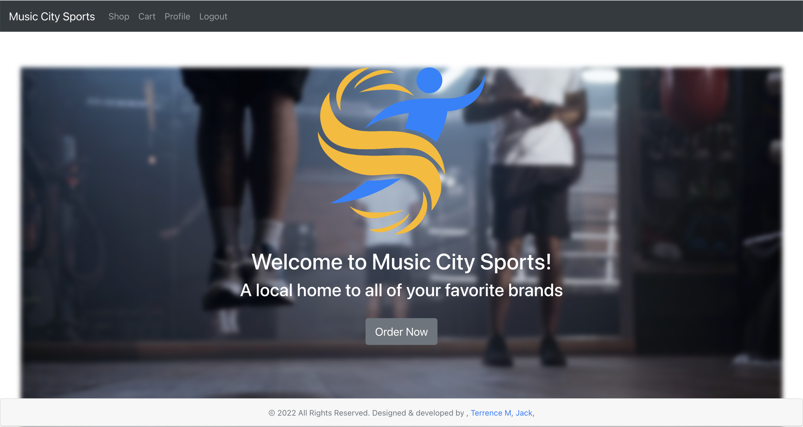

# Music City Sports

## Description
Music City Sports is a locally owned and operated sporting goods store that we made up in our heads. They were looking for a responsive, sleek website to help give them a leg up on the competition, as well as branching out to be able to take advantage of online purchasing.

## Table of Contents
- [Demonstration](#demonstration)
- [Installation](#installation)
- [Usage](#usage)
- [Licenses](#licenses)
- [Credits](#credits)
- [Questions](#questions)

## User Story

```
AS a small business owner,
I WANT a professional looking website that I can use to sell goods and promote my business
SO THAT I can promote my business and reach new markets by utilizing e-commerce
```

## Demonstration
Here's a look at the homepage:
;

Here's a look at the app in action:
;

## Installation
Clone the repository then run ``` npm install ``` in your CLI to get all of the dependencies. Then run ``` npm run seed ``` to seed the databases. Finally, run ``` npm run development ``` to get the app running locally.

## Usage
Check out the deployed website here:
https://morning-fortress-88075.herokuapp.com/ 

## Licenses
[](https://opensource.org/licenses/MIT)

## Credits
Created By:
[Terrence Mashoro](https://github.com/tmashoro)
[Jackson Petz](https://github.com/JacksonPetz)
[Jack Atkerson](https://github.com/JackAtkerson)

## Questions
Feel free to reach out to me at:
[E-Mail](mailto:jatkerson18@gmail.com),
[GitHub](https://github.com/JackAtkerson)